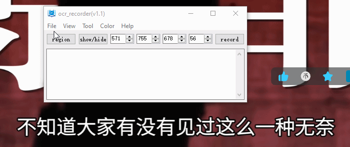
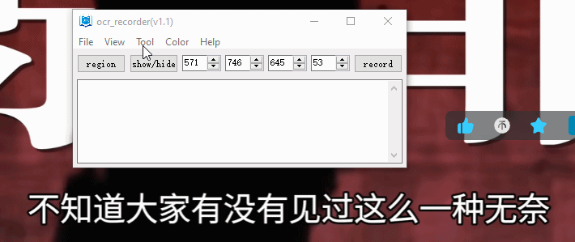
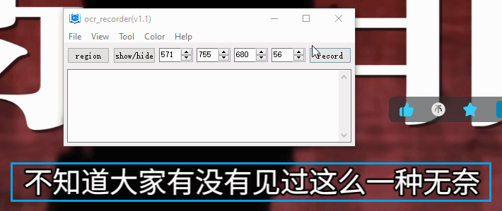
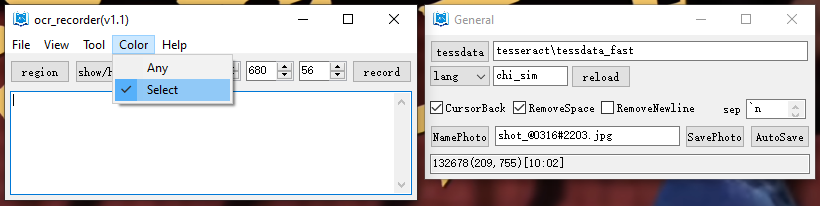
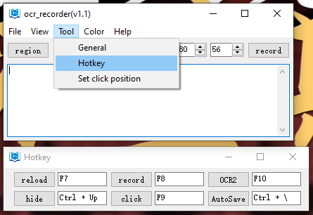
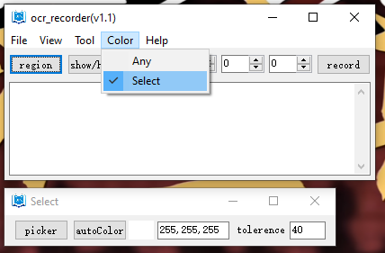

# OCR recorder

This program is to record the text on selected region of screen or an application (esp. a video player) for Windows.  

Most OCR applications grab text on screen and store it to clipboard, which is inconvenient especially if doing it frequently. OCR recorder is made to simiplify the procedure. Using OCR recorder, we can record the subtitles in a video with just one hotkey. Furthermore, OCR recorder provides the option to specify the character color so that the precision of ocr recognition can be improved in specific cases.

## How to Install

[GitHub Releases](https://github.com/bioxun/ocr_recorder/releases/latest)

## How to use

- Set target region

  

- Adjust target region

  

- Recognition and record

  

- Set model and parameters of tesseract

  Tesseract is the OCR engine of OCR recorder, so traineddata of tesseract is required, and it can be found at https://tesseract-ocr.github.io/tessdoc/Data-Files.html. And then, the path of the folder placing the traineddata should be set at 【tessdata】. Furthermore, the parameters of tesseract (e.g. lang, psm) can also be set just below 【tessdata】. 

  

- Hotkey settings

  

- 2 color modes for character: 1. any color; 2. monochrome

  In monochrome mode, specific color should be set for target characters. The color can be set in the window pop-up after clicking 【Select】. There 3 ways to set the color:
  1. click 【picker】 and click target color
  2. click 【autoColor】, which color will be selected by averaging the possible characters in the target rigion.
  3. write RGB color in the Edit control, e.g. 255,255,255 which means white color. 
  
  The 【tolerance】 box is used to set the range of color be treated as character color. The precision of OCR can be improved by adjust this value. 
  
  


## Build Instructions

Get the code:

- git clone https://github.com/bioxun/ocr_recorder.git

### Prerequisites

- CMake 3.10 or higher

- MinGW

  c++ in MinGW is used to make Dlls (region_selector.dll, dll_ocr_recorder.dll). 

- Packages in MinGW
  mingw-w64-x86_64-toolchain
  mingw-w64-x86_64-gcc
  mingw-w64-x86_64-tesseract-ocr
  mingw-w64-x86_64-opencv(>=4.5.5 and <4.12.0)
  mingw-w64-x86_64-leptonica
  mingw-w64-x86_64-lua 

- AutoHotKey v1
AutoHotkey v1 is required to build the main executable file, which calls the Dlls (region_selector.dll, dll_ocr_recorder.dll). 

- specify the right path of AutoHotkey in CMakeLists.txt

- specify the right path of tessdata in lua files (dll_ocr_recorder.lua, ocr_recorder.lua, test_dll_ocr_recorder.lua). 

### Build Steps
```bash
# Configure project
cmake -DCMAKE_CXX_COMPILER=g++ -DCMAKE_BUILD_TYPE=Release -S . -B ./build/release -G "MinGW Makefiles" -DCMAKE_INSTALL_PREFIX=install/release

# enter the build directory
cd build/release

# Build project
cmake --build . --target all --

# Run executable
./test_dll_ocr_recorder.exe
./ocr_screen.exe

```


## License

MIT License
