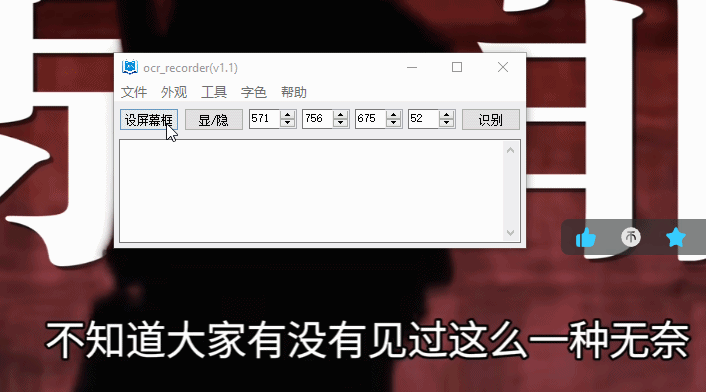
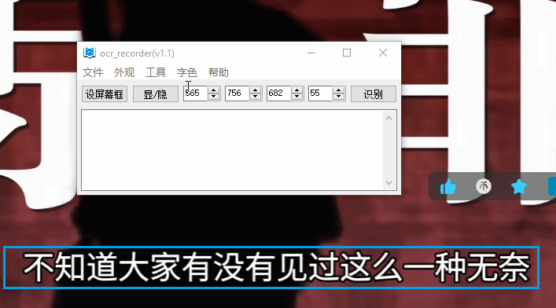
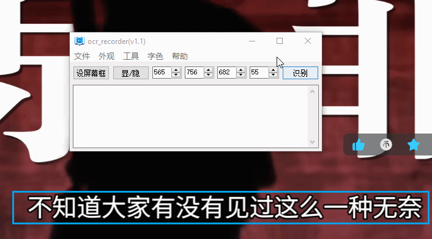
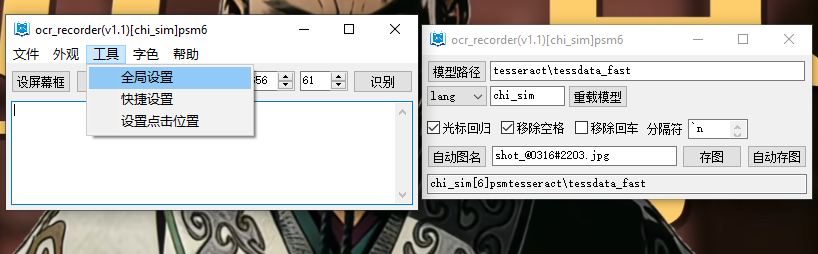
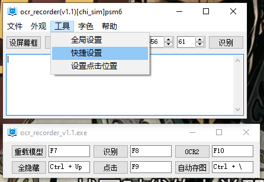
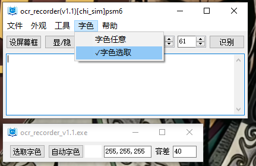

# OCR recorder

‌该程序用于在Windows系统上录制屏幕选定区域或某个应用程序（尤其是视频播放器）中的文字。‌
大多数OCR应用会捕获屏幕文字并将其保存到剪贴板，这种方式在频繁使用时尤为不便。‌OCR Recorder旨在简化这一流程‌，只需按下‌一个快捷键‌，即可录制视频中的字幕。此外，它还支持‌自定义文字颜色‌，从而在特定情况下提升OCR识别的准确率。


## 安装

- [GitHub Releases](https://github.com/bioxun/ocr_recorder/releases/latest)

## 使用说明

- 选取识别目标区域

  

- 调整识别目标区域

  

- 识别并记录

  

- 设置tesseract模型和相关参数

  tesseract的训练好的模型（traineddata）可以在https://tesseract-ocr.github.io/tessdoc/Data-Files.html 下载。然后，通过【模型路径】进行设置（可以是绝对路径，也可以是相对路径）。在【模型路径】下方可以设置tesseract的相关参数（例如，lang、psm）

  

- 设置快捷键

  

- 两种字色模式：1、字色任意；2、单一字色。

  模式2需要设定目标字色。可以手动设置：点击【选取字色】然后点击目标颜色。也可以自动选取字色，点击【自动字色】，然后会对目标框中的文字进行设别并对字色进行平均。在此基础上还可以在文本框中调整准确的RGB颜色值。最后的【容差】用于设置目标字色与所设颜色的最大（欧式）距离，通过调整这个值可以提高识别准确度。
  
  


## 构建说明

获取源代码:

- git clone https://github.com/bioxun/ocr_recorder.git

### 前提条件

- CMake 3.10 或更高版本

- MinGW

  MinGW中的C++用于构建两个Dlls文件：region_selector.dll用于生成选择框，dll_ocr_recorder.dll用于文字识别。

- 所需MinGW的库
  mingw-w64-x86_64-toolchain
  mingw-w64-x86_64-gcc
  mingw-w64-x86_64-tesseract-ocr
  mingw-w64-x86_64-opencv(>=4.5.5 and <4.12.0)
  mingw-w64-x86_64-leptonica
  mingw-w64-x86_64-lua 

- AutoHotKey v1
AutoHotkey v1被用于生成gui界面，并调用region_selector.dll和dll_ocr_recorder.dll，实现相关功能。

- 需要根据实际情况在CMakeLists.txt修改AutoHotkey的相关路径。

- 需要根据实际情况在lua文件中(test_dll_ocr_recorder.lua)设置tesserdata的路径，从而通过测试。

### 构建步骤
```bash
# Configure project
cmake -DCMAKE_CXX_COMPILER=g++ -DCMAKE_BUILD_TYPE=Release -S . -B ./build/release -G "MinGW Makefiles" -DCMAKE_INSTALL_PREFIX=install/release

# enter the build directory
cd build/release

# Build project
cmake --build . --target all --

# Run executable
./test_dll_ocr_recorder.exe
./ocr_screen.exe

```


## License

MIT License
